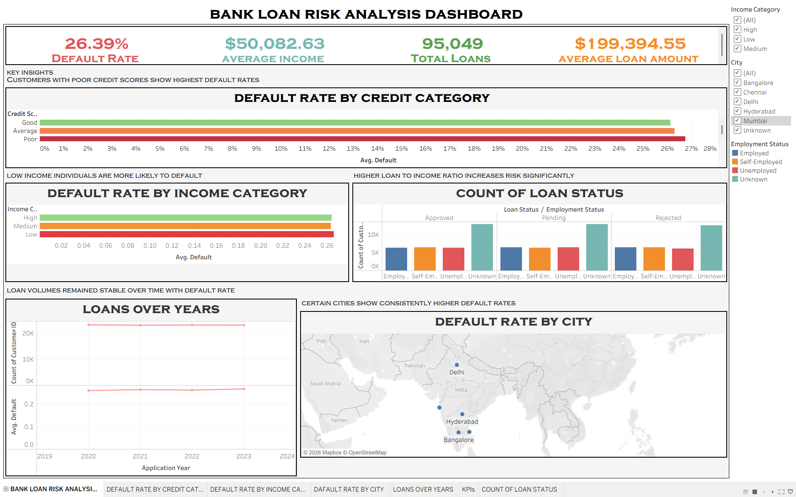

# Bank-loan-risk-analysis
End to end bank loan risk analysis project using Excel, PostgreSQL, and Tableau to identify key default patterns and customer risk segments.
#  Bank Loan Risk Analysis Dashboard

##  Project Overview

This project analyzes a large-scale bank loan dataset (100,000+ records) to identify key factors influencing loan defaults and customer risk behavior.

The analysis was performed using Excel, PostgreSQL, and Tableau, covering the complete data analytics pipeline from data cleaning to visualization.

##  Dashboard Preview

  

 Live Dashboard: [View on Tableau Public](https://public.tableau.com/app/profile/sudarshan.k2019/vizzes)

##  Tools Used

* Excel – Data Cleaning & Feature Engineering
* PostgreSQL – Data Analysis (SQL Queries)
* Tableau Public – Data Visualization & Dashboard

##  Dataset Features

* Customer demographics (Age, Gender, City)
* Financial details (Income, Loan Amount, Interest Rate)
* Credit-related attributes (Credit Score, Loan Status)
* Engineered features:
  * Loan-to-Income Ratio
  * Income Category
  * Credit Category
  * Age Group

##  Key Insights

* Customers with poor credit scores show significantly higher default rates
* Low-income individuals are more likely to default
* Higher loan-to-income ratios increase financial risk
* Certain cities exhibit consistently higher default rates
* Loan trends remained stable over time with consistent risk levels

##  Dashboard Highlights

* KPI Cards (Total Loans, Default Rate, Avg Income, Avg Loan Amount)
* Risk segmentation by credit score, income, and employment
* Geographic analysis of default rates
* Trend analysis of loan issuance over time

##  Conclusion

This project demonstrates end-to-end data analysis skills, including data cleaning, transformation, SQL-based analysis, and interactive dashboard creation.

##  Author

Sudarshan K
